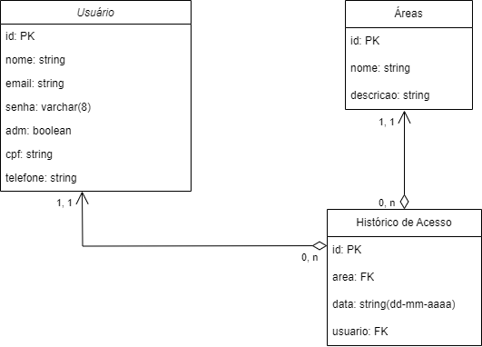

<div align="center" id="menu">


<h3> Monitoramento de acesso a área restrita </h3>

<p>
    <a href="#sobre">Sobre</a> | 
    <a href="#repositorios">Repositórios</a> | 
    <a href="#entrega">Entregas</a> |
    <a href="#backlog">Backlog</a> |  
    <a href="#modelo">Diagrama</a> | 
    <a href="#pasta">Pasta</a> | 
    <a href="#manuais">Manuais</a> |
    <a href="#equipe">Equipe</a>
</p>

<br>

 <a href="https://pt-br.reactjs.org/" target="blank"></a> 
 <a href="https://nodejs.org/en/about/" target="blank"></a>
 <a href="https://developer.mozilla.org/pt-BR/docs/Web/JavaScript" target="blank"></a> 
 <a href="https://www.typescriptlang.org/" target="blank"></a> 
 <a href="https://developer.mozilla.org/pt-BR/docs/Web/HTML" target="blank"></a>
 <a href="https://developer.mozilla.org/pt-BR/docs/Web/CSS" target="blank"></a> 

 <a href="https://www.mongodb.com/pt-br" target="blank"></a> 
 <a href="https://www.atlassian.com/br/software/jira/guides/getting-started/introduction" target="blank"></a>
 <a href="https://www.docker.com/" target="blank">
 <a href="http://www.figma.com" target="blank"></a> 
 <a href="https://code.visualstudio.com/" target="blank"></a> 
 <a href="https://slack.com/intl/pt-br" target="blank"></a>
 <a href="https://aws.amazon.com/pt/free" target="blank"></a>
 <a href="https://vercel.com/" target="blank">
 <a href="https://github.com/" target="blank"></a> 

</div> 

<br>

<span id="sobre">

## :pencil: Sobre o projeto

O projeto, realizado em parceria com a Altave, foca no desenvolvimento de um sistema de monitoramento de acesso a áreas restritas no setor de óleo e gás, áreas restritas são acessadas apenas por pessoas autorizadas para manutenções específicas e o monitoramento dessas áreas é feito por câmeras supervisionadas pela equipe de segurança. No entanto, devido ao grande número de câmeras e à dependência de interação humana, falhas ocorrem frequentemente. 

A proposta é mitigar esses erros com sensores nas portas de acesso que ao serem abertas geram um aviso de acesso e a equipe de segurança informará se o acesso foi autorizado. 

No sistema permitirá análise periódica dos dados, exibindo gráficos sobre o número de acessos e o tempo de inatividade de uma área. Além disso, a emissão de avisos incluirá a opção de abrir o acesso à câmera da área e realizar comentários, facilitando uma análise automática de recorrência e gravidade. Para auxiliar os usuários, o sistema contará com um chatbot disponível em todas as telas, fornecendo informações e orientações.

Confira o design inicial:

 - Mockup: [clique e veja através no Figma](https://www.figma.com/design/BgIaM61bI3gERx69T6n6ap/API-6-Altave?node-id=0-1&t=5mNhBT41RAxAD8zG-1) 
 - Protótipo navegável: [navegue entre as páginas](https://www.figma.com)

<br>

<span id="repositorios">

<h2> 🗂 Repositórios </h2>

- Repositório Frontend: [https://github.com/RatanabaOrg/PLN_Front_End.git](https://github.com/RatanabaOrg/PLN_Front_End.git)

- Repositório Backend: [https://github.com/RatanabaOrg/PLN_Back_End.git](https://github.com/RatanabaOrg/PLN_Back_End.git)

<br>

<span id="entrega">

## 🏁 Entregas de Sprints
| Sprint |         Datas           |      Status      |     Relatório     |   Tag   |
| :----: | :---------------------: | :--------------: | :---------------: | :------:|
|   01   | 09/09/2024 à 29/09/2024 |  Em andamento 🕒 | [Ver](https://github.com/RatanabaOrg/PLN_Documentacao/tree/main/doc/Sprint_1) 👁️ | [1.0.0](https://github.com/RatanabaOrg/PLN_Documentacao/releases/tag/v1.0.0)|
|   02   | 07/10/2024 à 27/10/2024 |  Não iniciada ❌ | - | - |
|   03   | 04/11/2024 à 24/11/2024 |  Não iniciada ❌ | - | - |

<br>

<span id="backlog">  

## :pushpin: Backlog do Produto  

 #### Épicos (Requisitos Funcionais) 

| SPRINT | CÓDIGO | DESCRIÇÃO                                                                           | STATUS |
| :----: | :----: | :---------------------------------------------------------------------------------- | :----: |
|   1    |  RF1   | Interface de administrador, com cadastro de usuários e áreas                        |   🕒  |
|   1    |  RF2   | Interface de visualização dos acessos realizados                                    |   🕒  |
|   2    |  RF3   | Dashboard com histórico de acessos                                                  |    -   |
|   2    |  RF4   | Responsividade                                                                      |    -   |
|   3    |  RF5   | ChatBot de auxílio a utilização do sistema                                          |    -   |
|   3    |  RF6   | Hospedagem em nuvem                                                                 |    -   |

#### Requisitos Não Funcionais  

| CÓDIGO | DESCRIÇÃO                                            | STATUS |
| :----: | :--------------------------------------------------- | :----: |
|  RNF1  | Guia de instalação, GitHub e hospedagem              |    -   |
|  RNF2  | Manual do usuário                                    |    -   |
|  RNF3  | Modelagem de banco de dados                          |    -   |
|  RNF4  | Desejável que o sistema seja acessível online        |    -   |
|  RNF5  | Desenvolver um simulador do sensor de porta          |    -   |

<br>

<span id="pasta">

## :file_folder: Conteúdo da Pasta docs

Na pasta `docs` deste repositório, você encontrará dois arquivos essenciais para o projeto:

Modelagem de Dados (modelagem_dados.png): Este arquivo contém o diagrama de banco de dados, oferecendo uma visão detalhada da estrutura e relacionamento entre as entidades do sistema.

Requisitos (Prequisitos_cliente.pdf): Um documento que descreve os requisitos funcionais e não funcionais do sistema, incluindo informações sobre as funcionalidades essenciais, como cadastro de usuários, monitoramento de acessos e análise de incidentes.

<br>

<span id="modelo">

 ## :cloud: Modelo do banco de bados



<br>

 <span id="manuais">

 ## :scroll: Manual de instalação e do usuário

Para garantir o bom funcionamento do sistema em seu ambiente local, é necessário instalar o Node.js. Siga os passos abaixo para preparar seu ambiente:

1. Instalação do Node.js:

  ```
  https://nodejs.org/pt/download/prebuilt-installer
  ```

2. Siga os passos do manual de instalação do backend, o link se encontra abaixo:

  ```
  https://github.com/RatanabaOrg/PLN_Back_End
  ```

3. Siga os passos do manual de instalação do frontend, o link se encontra abaixo:

  ```
  https://github.com/RatanabaOrg/PLN_Front_End
  ```

[Manual do usuario.pdf](https://github.com)

 <br>

<span id="equipe"> 

## :busts_in_silhouette: Equipe

|           Nome            |    Função     |        Redes profissionais        |
| :-----------------------: | :-----------: | :-------------------------------: |
| Amanda Vieira de Oliveira |  Scrum Master |  [](https://www.linkedin.com/in/amanda-vo/) <br> [](https://github.com/amandavo) |
|   Lucas França Registro   | Product Owner | [](https://www.linkedin.com) <br> [](https://github.com/LucasFrancaRegistro) |
|  Carlos Eduardo Falandes  |    Dev Team   | [](http://lattes.cnpq.br/3579183651868833) <br> [](https://github.com/Desduh) |
|    Júlia Sousa Gayotto    |    Dev Team   | [](https://www.linkedin.com/in/júlia-gayotto/) <br> [](https://github.com/JuliaGayotto) |

<a href="#menu">Voltar ao topo</a>
